# fhnw-ios-clock

A simple world clock app written in Swift for iOS devices.

This project was created for the course [ios](https://www.fhnw.ch/de/studium/module/9352170) at [FHNW University](https://www.fhnw.ch), held in late 2021.

## Contributors:

- [AndiSwiss](https://github.com/AndiSwiss)

- [chdabre](https://github.com/chdabre)

## Features

- Runs with iOS15
- Shows a hard-coded static list of cities with different time zones
- Some time zones not only have hour-offsets, but also minute-offsets, e.g., Time zone "Australia/Eucla" with +8:45
- Provides a detail-view when a list entry ist clicked with a larger clock
- Conforms to the MVVM principle
- Has some animations included: 
  - Starting animation from time 0:00:00
  - Smooth transition to new watch hand position
- Provides adopted landscape views according this [guide](https://www.hackingwithswift.com/quick-start/swiftui/how-to-create-different-layouts-using-size-classes) from HackingWithSwift: Using a vertical layout if the `horizontalSizeClass == .compact`. For different devices, this will evaluate to different results. Examples (see also various screenshots at the end of this README):
  - iPhone 13 Pro Max: **only** in `.compact` when in Portrait mode
  - iPhone13: **always** in `.compact`
  - iPod Touch (7th generation): **always** in `.compact`
  - iPad Pro 12.9-inch: **never** in `.compact`

## Problems

- While we tried to implement a nice animation, we could not solve the problem that the seconds watch hand runs backward when moving from 59 to 0.

## AppIcon - Sources

The AppIcon was designed with Figma and the following two assets were used:

- https://iconmonstr.com/globe-5-svg
- https://iconmonstr.com/time-2-svg

The icon-sets itself were generated based on the SVG-export of Figma with https://easyappicon.com (iPhone) and https://appicon.co (iPad)

## Screens

### iPhone 13 Pro Max

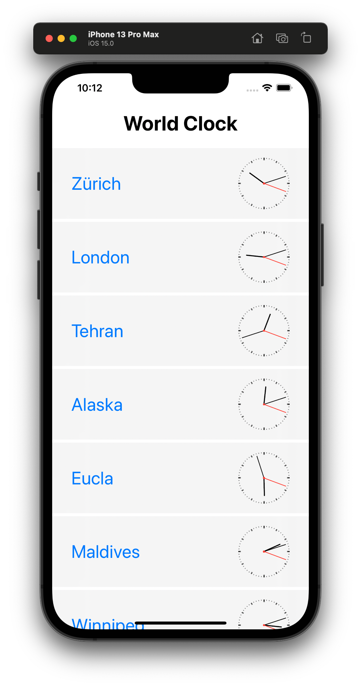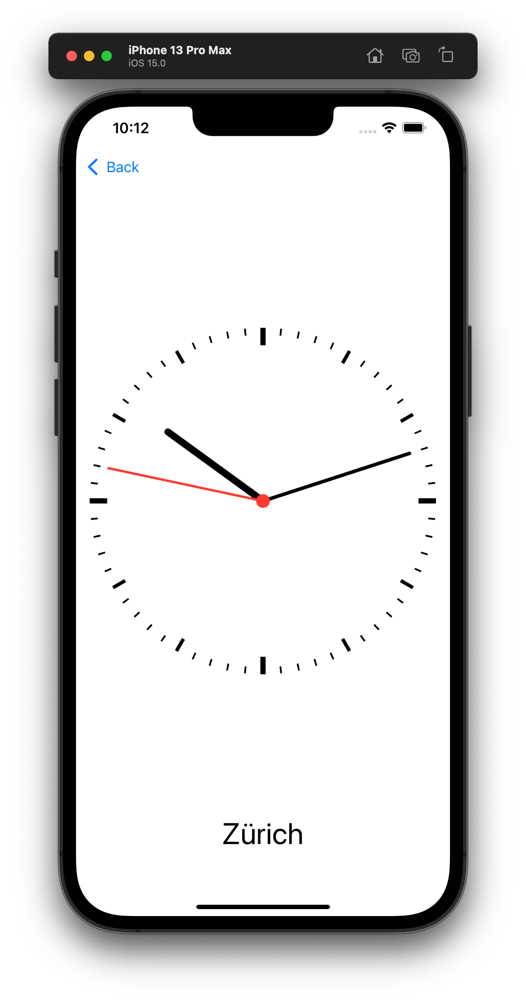

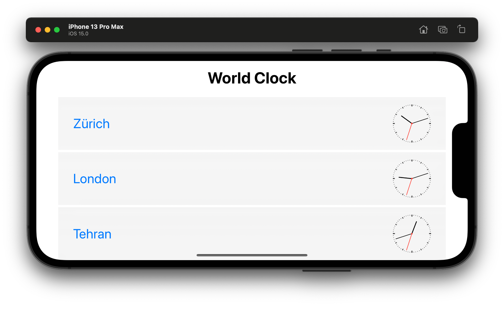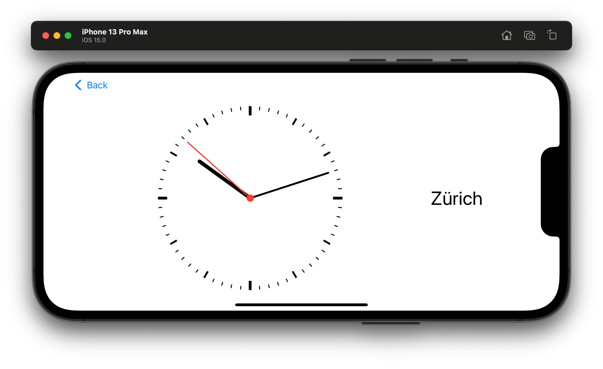

### iPhone 13

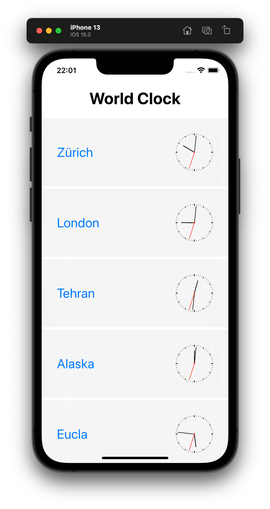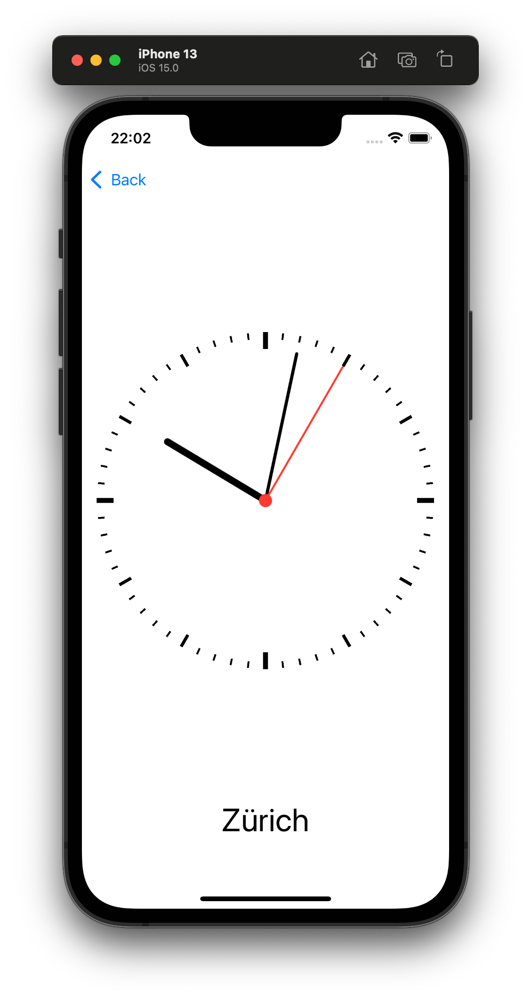

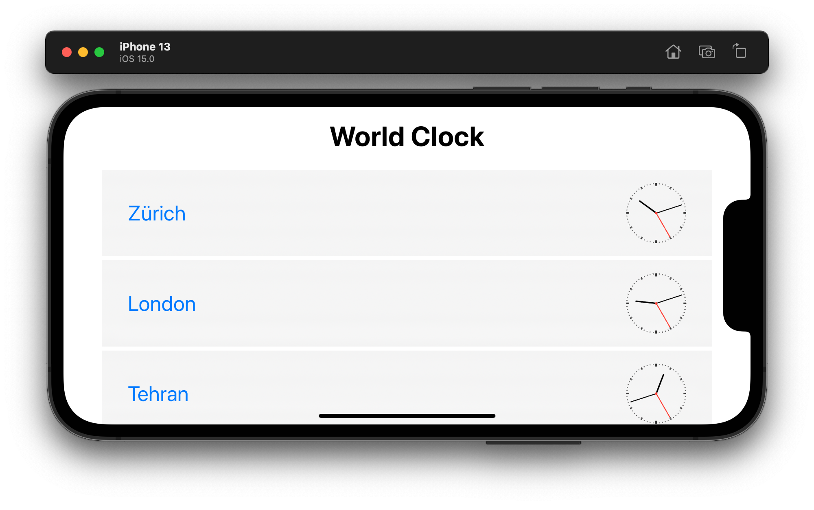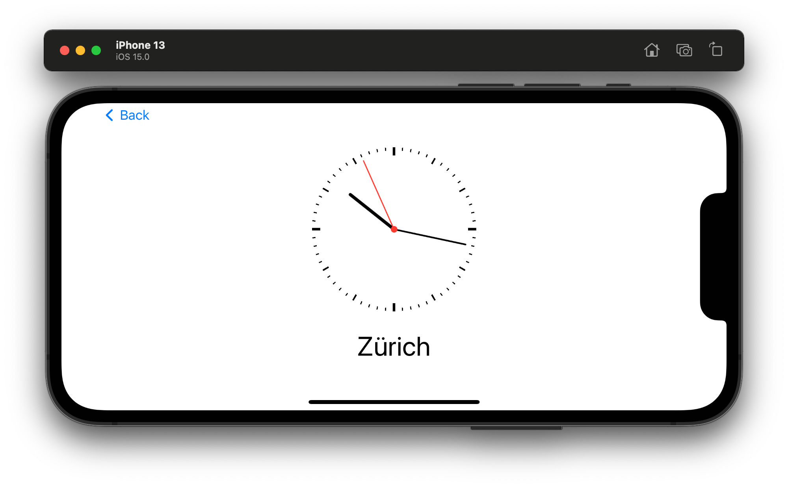

### iPod Touch (7th generation)

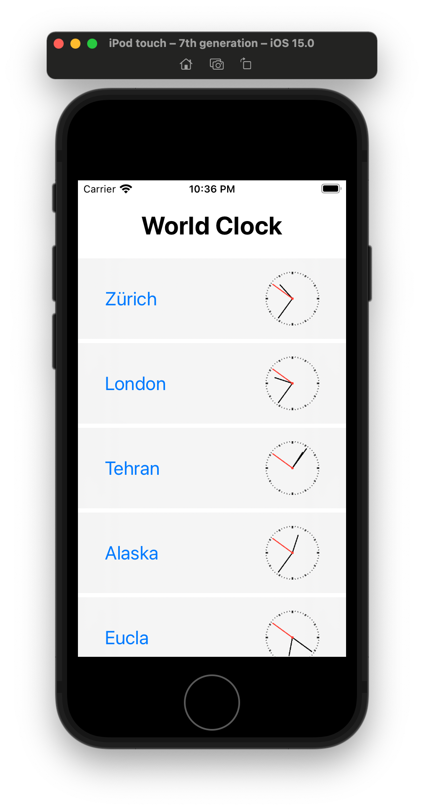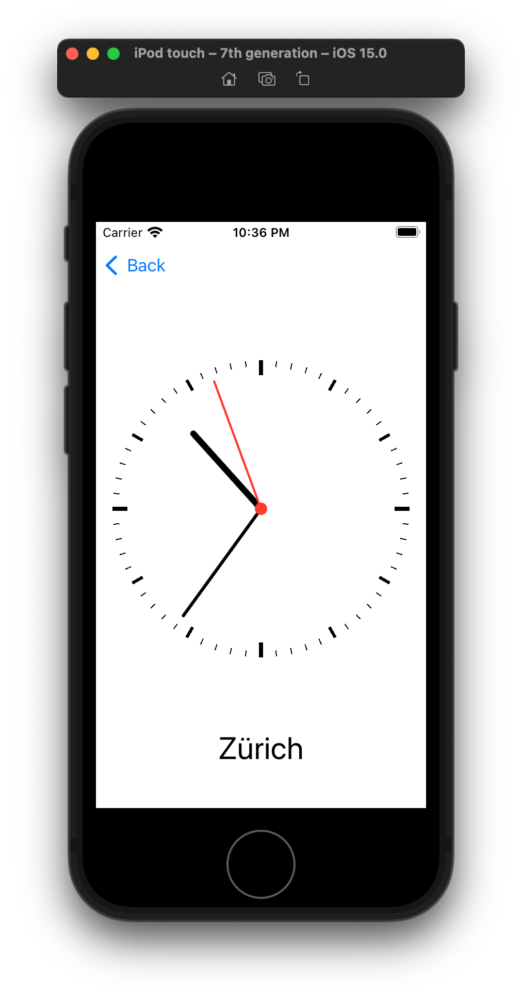

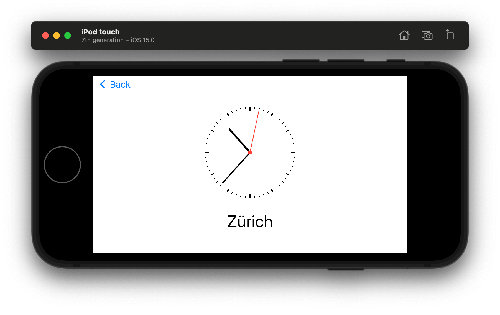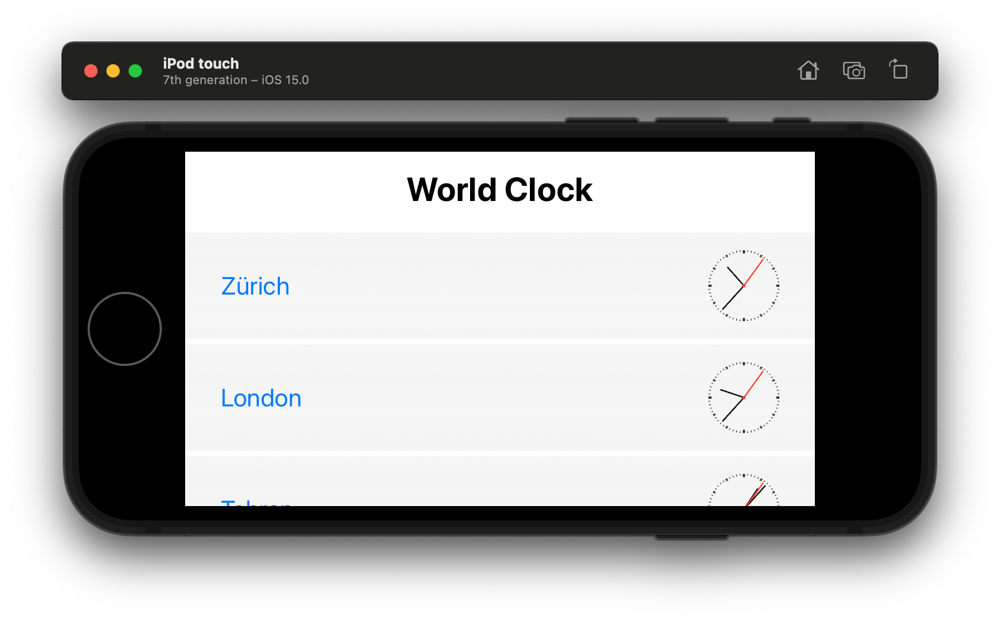

### iPad Pro 12.9-inch

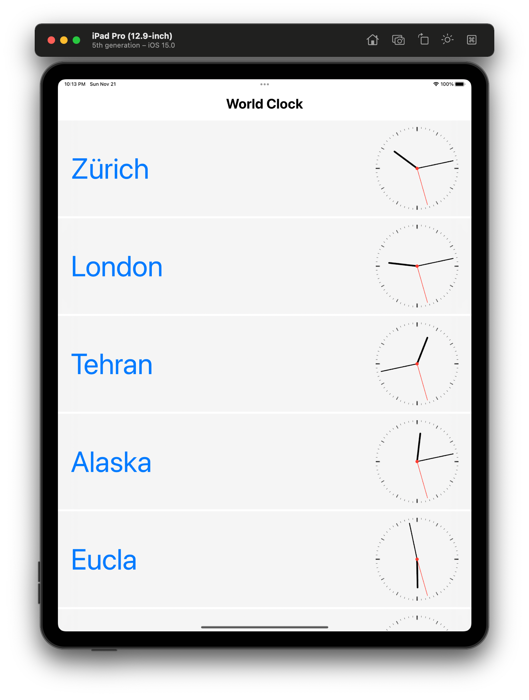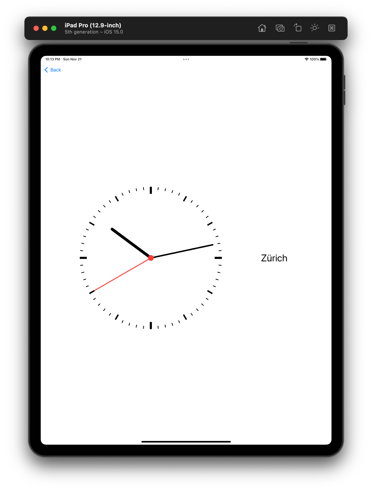

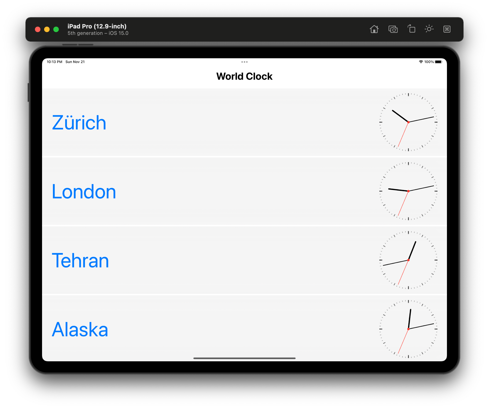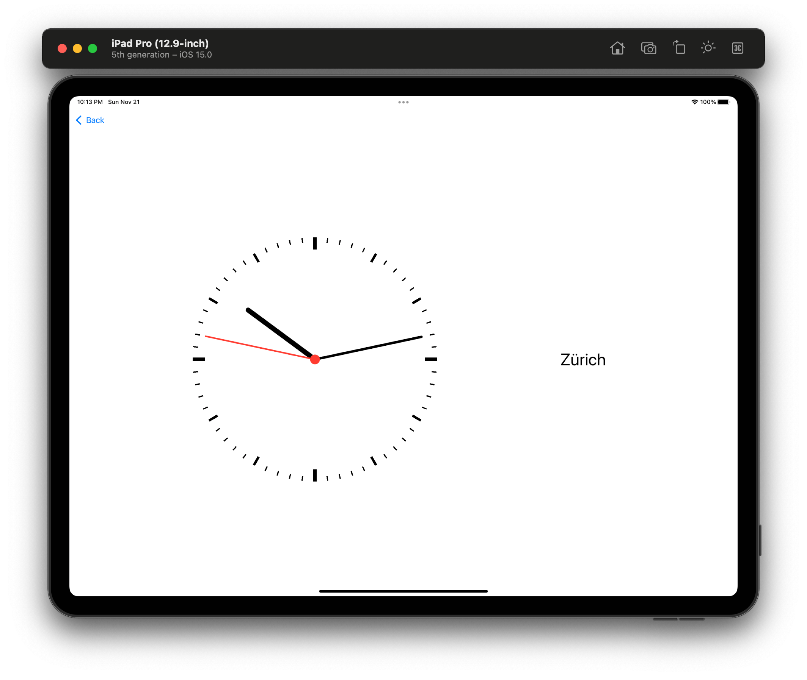

